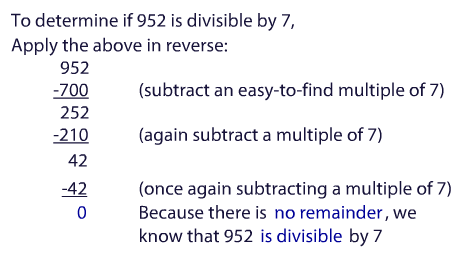
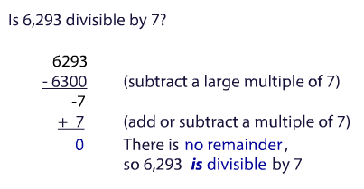

# Notes

- [Memorizations](/quantitative-reasoning/memorizations.md)

# Skill Builders

## Integers

- Zero is neight positive nor negative.
- Zero is Even Integer.

## Addition Shortcuts

```
98 + 47

Better: (98 + 2) + (45 - 2) = 100 + 45 = 45
```

## Addition Drill

Watch Video on [Veritas Prep](https://www.veritasprep.com/account/gmat/skillbuilder_selector.php).

## Substraction Shortcuts

```
82 - 17

Better: (82 - 77) + (77 - 17) = 5 + 60 = 65
```

## Substraction Drill 

Watch Video on [Veritas Prep](https://www.veritasprep.com/account/gmat/skillbuilder_selector.php).

## Simplifying Calculations 

See `26. Simplifying Calculations`. It has useful techniques. 

```
28 * 15 = 28/2 * 15*2 = 14 * 30 = 420
```

15% of a number 

```
15% of A = 10% of A + (10% of A)/2 
15% 624  = 62.4     + 31.2 = 93.6
```

Another technique 

```
99 * 237 = (100 - 1) * 237 = 23700 - 237 = 23463
```

## Use of Scientific Notation

```
  673 * 19423
= 6.73 * 10^2 * 1.9423 * 10^4
= (<7) * (<2) * 10^6 
< 14 million
```

## Lower Common Denominator


## Prime Numbers

Prime number:

- Positive Integer
- Divisible by **exactly two factors**: 1 and itself

Not a prime number: 

- 1 (only has 1 factor)
- 0 (not positive - and not divisible by itself)

2 is **the only even prime** number

## Universal Divisibility Strategy 




## Greatest Common Factor (GCF)

Largest number that is a divisor of each of a set of numbers. 

- Start with **prime factorization** of the numbers involved.
- Pick out **which factors are in common** (only those in common).
  
Example: Find the GCF of 12 and 18

```
12 = 2 * 2 * 3
     ^       ^
18 = 2 * 3 * 3
     ^   ^
GCF = 2 * 3 = 6
```
