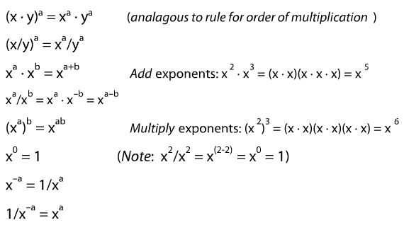
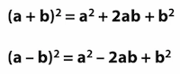
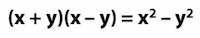
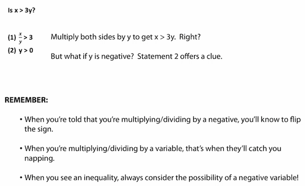

## Elimination Method for Solving Simultaneous Equations

```
Example: Solve the following

Eq 1: 2x + 3y = 8
Eq 2: 3x + 2y = 7

3 * Eq 1 --> 6x + 9y = 24
2 * Eq 2 --> 6x + 4y = 14

Substract Eq 2 from Eq 1: 

  6x + 9y = 24
-(6x + 4y = 14)
=      5y = 10

y = 2 --> 2x + 6 = 8 --> x = 1
```

## Properties of Exponents



## Common Quadratic Formulas to Memorize





## Watch Out of Inequalities


