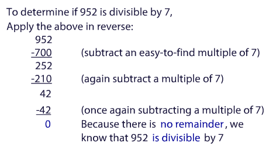
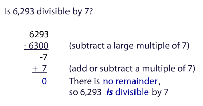
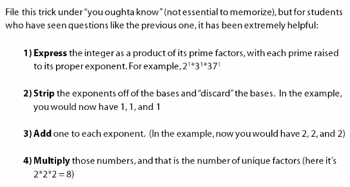

- [Integers](#integers)
- [Addition Shortcuts](#addition-shortcuts)
- [Addition Drill](#addition-drill)
- [Substraction Shortcuts](#substraction-shortcuts)
- [Substraction Drill](#substraction-drill)
- [Simplifying Calculations](#simplifying-calculations)
- [Use of Scientific Notation](#use-of-scientific-notation)
- [Lower Common Denominator (Lowest Common Multiple)](#lower-common-denominator-lowest-common-multiple)
- [Prime Numbers](#prime-numbers)
- [Universal Divisibility Strategy](#universal-divisibility-strategy)
- [Greatest Common Factor (GCF)](#greatest-common-factor-gcf)
- [How high do you test for a factor?](#how-high-do-you-test-for-a-factor)
- [Trick to find the total number of unique factors](#trick-to-find-the-total-number-of-unique-factors)
- [Memorizations](#memorizations)
  - [Powers of 2](#powers-of-2)
  - [Common Fractions/Decimal Conversion](#common-fractionsdecimal-conversion)
  - [Common Multiplications](#common-multiplications)
  - [Prime Numbers](#prime-numbers-1)
  - [Divisibility Rules](#divisibility-rules)
  - [Even/Odd Number Properties](#evenodd-number-properties)
  - [The ONLY numbers with only 3 factors are squares of prime numbers](#the-only-numbers-with-only-3-factors-are-squares-of-prime-numbers)

## Integers

- Zero is neight positive nor negative.
- Zero is Even Integer.

## Addition Shortcuts

```
98 + 47

Better: (98 + 2) + (45 - 2) = 100 + 45 = 45
```

## Addition Drill

Watch Video on [Veritas Prep](https://www.veritasprep.com/account/gmat/skillbuilder_selector.php).

## Substraction Shortcuts

```
82 - 17

Better: (82 - 77) + (77 - 17) = 5 + 60 = 65
```

## Substraction Drill 

Watch Video on [Veritas Prep](https://www.veritasprep.com/account/gmat/skillbuilder_selector.php).

## Simplifying Calculations 

See `26. Simplifying Calculations`. It has useful techniques. 

```
28 * 15 = 28/2 * 15*2 = 14 * 30 = 420
```

15% of a number 

```
15% of A = 10% of A + (10% of A)/2 
15% 624  = 62.4     + 31.2 = 93.6
```

Another technique 

```
99 * 237 = (100 - 1) * 237 = 23700 - 237 = 23463
```

## Use of Scientific Notation

```
  673 * 19423
= 6.73 * 10^2 * 1.9423 * 10^4
= (<7) * (<2) * 10^6 
< 14 million
```

## Lower Common Denominator (Lowest Common Multiple)


## Prime Numbers

Prime number:

- Positive Integer
- Divisible by **exactly two factors**: 1 and itself

Not a prime number: 

- 1 (only has 1 factor)
- 0 (not positive - and not divisible by itself)

2 is **the only even prime** number

## Universal Divisibility Strategy 




## Greatest Common Factor (GCF)

Largest number that is a divisor of each of a set of numbers. 

- Start with **prime factorization** of the numbers involved.
- Pick out **which factors are in common** (only those in common).
  
Example: Find the GCF of 12 and 18

```
12 = 2 * 2 * 3
     ^       ^
18 = 2 * 3 * 3
     ^   ^
GCF = 2 * 3 = 6
```

## How high do you test for a factor? 

- **The Rule:** Test up until the square root of the next perfect square
- **Example:** Is 113 prime? Test up to 11 (Square root of 121)

## Trick to find the total number of unique factors



## Memorizations

### Powers of 2

| Notation | Power | Result |
| -------- | ----- | ------ |
| 2^1      | 1     | 2      |
| 2^2      | 2     | 4      |
| 2^3      | 3     | 8      |
| 2^4      | 4     | 16     |
| 2^5      | 5     | 32     |
| 2^6      | 6     | 64     |
| 2^7      | 7     | 128    |
| 2^8      | 8     | 256    |
| 2^9      | 9     | 512    |
| 2^10     | 10    | 1024   |
| 2^11     | 11    | 2048   |
| 2^12     | 12    | 4096   |
| 2^13     | 13    | 8192   |
| 2^14     | 14    | 16384  |
| 2^15     | 15    | 32768  |

### Common Fractions/Decimal Conversion

| Fraction | Decimal   |
| -------- | --------- |
| 1/2      | 0.5       |
| **1/3**  | **0.333** |
| 1/4      | 0.25      |
| 1/5      | 0.2       |
| **1/6**  | **0.166** |
| **1/7**  | **0.143** |
| 1/8      | 0.125     |
| **1/9**  | **0.111** |
| 1/10     | 0.1       |

### Common Multiplications

|      |     |
| ---- | --- |
| 11^2 | 121 |
| 12^2 | 144 |
| 15^2 | 225 |
| 25^2 | 625 |

### Prime Numbers

```
2, 3, 5, 7, 11, 13, 17, 19, 23, 29, 31, 37
```

### Divisibility Rules

| number | condition                                | example         |
| ------ | ---------------------------------------- | --------------- |
| 2      | If even                                  | 122 = 61 * 2    |
| 3      | If sum of digis divisible by 3           | 528 = 176 * 3   |
| 4      | If last 2 digits divisible by 4          | 724 = 181 * 4   |
| 5      | If last digit is a 5 or 0                | 255 = 51 * 5    |
| 6      | If even and sum of digits divisible by 3 | 222 = 37 * 6    |
| 9      | If sum of digits divisible by 9          | 558 = 62 * 9    |
| 10     | If last digit is 0                       | 420 = 42 * 10   |
| 25     | If last 2 digits is divisible by 25      | 0, 25, 50, 75.. |

### Even/Odd Number Properties

| Addition/Substration |      |     | Addition/Multiplication |      |
| -------------------- | ---- | --- | ----------------------- | ---- |
| Odd +/- Odd          | Even |     | Odd * Odd               | Odd  |
| Odd +/- Even         | Odd  |     | Odd * Even              | Even |
| Even +/- Even        | Even |     | Even * Even             | Even |

### The ONLY numbers with only 3 factors are squares of prime numbers

For example, `4, 9, 25, 49, or 121...` and so on.
