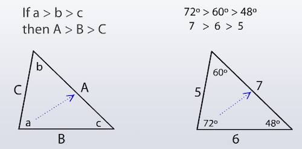
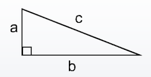
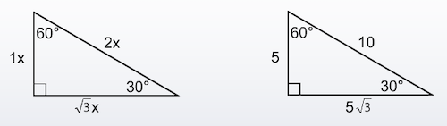
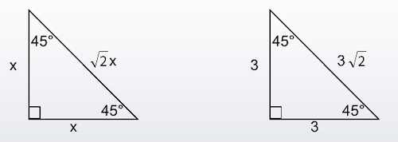
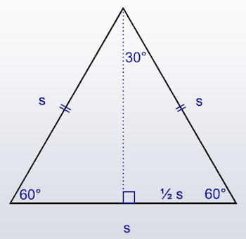
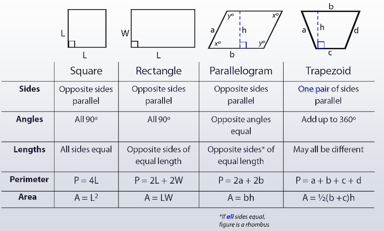
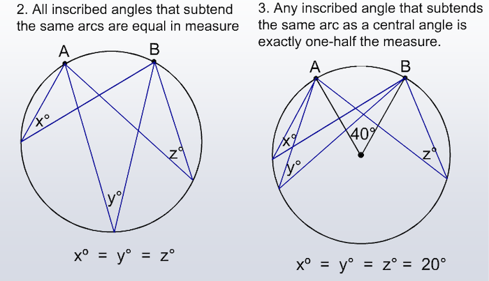

<!-- omit in toc -->
# Geometry

- [Triangles](#triangles)
  - [Right Triangles](#right-triangles)
  - [Common Right Triangles Ratios](#common-right-triangles-ratios)
  - [Common Right Triangles](#common-right-triangles)
    - [30-60-90 Triangles](#30-60-90-triangles)
    - [Isosceles Right Triangles](#isosceles-right-triangles)
    - [Equilateral Triangles](#equilateral-triangles)
- [Quadrilaterals](#quadrilaterals)
- [Circles](#circles)
  - [Arcs & Inscribed Angles](#arcs--inscribed-angles)
- [Coordinates](#coordinates)
  - [Slope](#slope)
  - [Distance Formula](#distance-formula)

## Triangles

- Area of Triangle = (base * Height)/2


- Longest side is opposite of largest angle, etc



### Right Triangles

- Pythagorean Theorem: `a^2 + b^2 = c^2` --> *If know 2 sides, can find 3rd*



### Common Right Triangles Ratios

```
3^2 + 4^2 = 5^2
12^2 + 5^2 = 13^2
```

### Common Right Triangles

#### 30-60-90 Triangles



#### Isosceles Right Triangles



#### Equilateral Triangles

|        | 30°   | 60°           | 90° |
| ------ | ----- | ------------- | --- |
| Ratio  | 1x    | sqrt(3) * x   | 2x  |
| Length | 1/2 S | 1/2 S sqrt(3) | S   |

- Area = `Sqrt(3) / 4 * S^2`



## Quadrilaterals



## Circles

- `Pi = 3.14 = 22/7`

### Arcs & Inscribed Angles



## Coordinates

### Slope

```
y = mx + b --> m = slope
Slope = (y2 - y1) / (x2 - x1)
```

### Distance Formula 

```
Distance = sqrt((x2 - x1)^2 + (y2 - y1)^2)
```

If lines are perpendiculr, then slopes are negative reciprocals
  
```
Line 1: y = 2x + 4
Line 2: y = -1/2 + 2
Line 1 is perpendicular to Line 2
```
