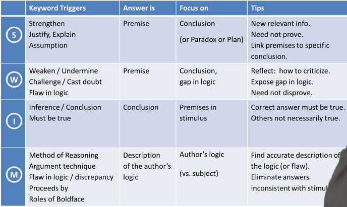

Content

- [Examples for Conclusion Language Words](#examples-for-conclusion-language-words)
- [Examples for Call for Action Words](#examples-for-call-for-action-words)
- [Examples for Premise Wording to Set up a Conclusion](#examples-for-premise-wording-to-set-up-a-conclusion)
- [Four types of Reasoning Questions](#four-types-of-reasoning-questions)
- [Reading Critically](#reading-critically)
- [SWIM Tips](#swim-tips)
- [Common Fallacies/Gaps](#common-fallaciesgaps)
- [Assumption Negation](#assumption-negation)
- [Tips](#tips)

## Examples for Conclusion Language Words

- Therefore
- Thus 
- Hence
- In conclusion

## Examples for Call for Action Words

- We should 
- They must 

## Examples for Premise Wording to Set up a Conclusion

- Because of X, Y is true (Y is the conclusion, based on X)

## Four types of Reasoning Questions

| Type                | Requirement                                                       |
| ------------------- | ----------------------------------------------------------------- |
| Strengthen          | Asked to strengthen an existing conclusion                        |
| Weaken              | Asked to weaken an existing conclusion                            |
| Inference           | Asked to draw a conclusion                                        |
| Method of Reasoning | Asked to analysze the functions of statements within the argument |

## Reading Critically

- **Stengthen questions:**
  - Identify and fill gaps in logic.
- **Weaken questions:** 
  - Identify and exploit gaps in logic.
- **Inference questions:**
  - Eliminate answers that are not fully supported by the premises.
- **Method of Reasoning questions**
  - Dissect the argument.
  - Often must assess the validity or weakness of the argument. 

|                         |                                                                |
| ----------------------- | -------------------------------------------------------------- |
| **Stengthen**           | Add new information to support an existing conclusion          |
| **Weaken**              | Add new information that will undermine an existing conclusion |
| **Inference**           | Draw your own inference or conclusion                          |
| **Method of Reasoning** | Analyze and either describe or mimic the line of reasoning     |

## SWIM Tips 

## Common Fallacies/Gaps

1. Causation vs. Correlation
2. Generalization
3. Data & Statistical Flaws

## Assumption Negation 

An important technique to eliminate answer choices in assumption questions.

Negate each answer and see if the conclusion still holds or not. 
If it still holds, then it's a wrong answer.

The answer should be an assumption that the conclusion *requires* but not further it along.

## Tips

- In an Inference question, the first line of defense is the “no new information” filter. 
- Valid conclusions must *always* (not just sometimes) be true, and therefore must be based entirely
  on the information found in the premises.
- In Stengthen/Weaken Questions, first identify the argument's conclusion. Then find the gaps between
  the conclusion and its premises. 

> Animals could make major changes in their behavior **only if** they were capable of complex reasoning.

- "Only if" means that it's the *only single possible way*. Watch out.
