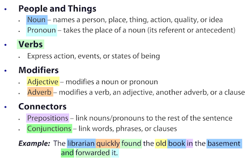
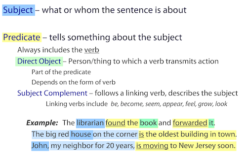
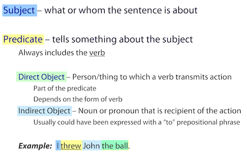
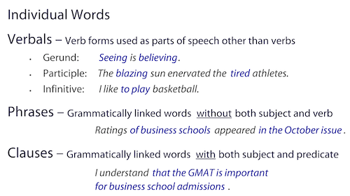
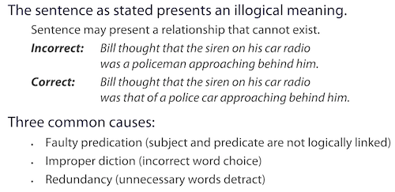
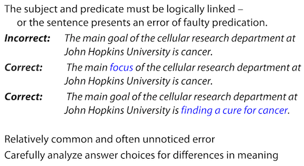
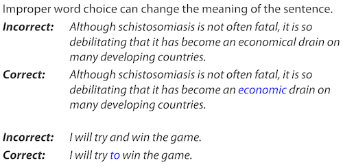
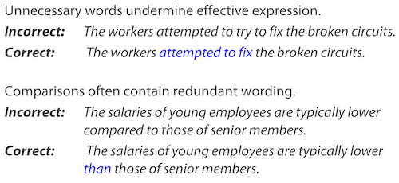

Content

- [Parts of Speech](#parts-of-speech)
- [Parts of a Sentence](#parts-of-a-sentence)
- [Building Block of Grammmar](#building-block-of-grammmar)
- [Illogical Meaning](#illogical-meaning)
  - [1. Faulty Dictation](#1-faulty-dictation)
  - [2. Improper Dictation](#2-improper-dictation)
  - [3. Redundancy](#3-redundancy)
- [Modifier Errors](#modifier-errors)
  - [1. Prepositional Phrases](#1-prepositional-phrases)
  - [2. Participial Phrases](#2-participial-phrases)
    - [Rules for Participial Phrases](#rules-for-participial-phrases)
  - [3. Appositive Phrases](#3-appositive-phrases)
  - [4. Relative Clauses](#4-relative-clauses)

## Parts of Speech

## Parts of a Sentence

## Building Block of Grammmar

## Illogical Meaning

### 1. Faulty Dictation

### 2. Improper Dictation

### 3. Redundancy

## Modifier Errors

### 1. Prepositional Phrases

Whena prepositional phrase serves as an adjective, it almost
always must appear beside the noun, noun phrase, or pronoun
that it modifies.

- **Incorrect:** The house belongs to John Smith on the corner.
- **Correct:** The house on the corner belongs to John Smith.

When a prepositional phrase serves as an adverb,
its location may vary.

- **Correct:** Visitors to the zoo have often looked up into the leafy aviary and 
  seen macaws resting on the branches, with tails trailing like brightly colored splatters of 
  paint on a green canvas.
- **Incorrect:** Bill usually drops any groceries he has brought home from his job on the 
  kitchen table.
- **Correct:** Uponcoming home from work, Bill usually drops any
  groceries on the kitchen table.
- **Incorrect:** The Supreme Court recently ruled that the state had failed
  to provide some prison inmates with proper healthcare
  in violation of the constitution.
- **Correct:** The Supreme Court recently ruled that the state, in violation
  of the constitution, had failed to provide some prison
  inmates with healthcare.

### 2. Participial Phrases

Participle: a verb form used as an adjective.

Examples:
- The **crying** baby finally fell asleep.
- **Smiling**, the woman left the room.
- The **wrecked** car was sent to the salvage yard.

Participial phrase: a longer modifying phrase starting with a participle

Examples:
- **Bombarded by bullets**, the troops retreated.
- Dogs **trained by professionals** are much more obedient.
- Kit Carson roamed the Rockies and the Southwest, **working as a trapper** 
  and **establishing a reputation as one of the most able mountain men of his time**.

#### Rules for Participial Phrases

1. If a participial phrase begins the sentence, it must logically modify the noun that follows the comma

- **Error:** Alarmed by the recent decline of the stock market, many 
  retirement **investments** have been switched from stocks to more 
  conservative options, such as money market funds.
- **Corrected:** Alarmed by the recent decline of the stock market, 
  many **investors** have switched their retirement investments 
  from stocks to more conservative options, such as money
  market funds.


2. If used in the middle of a sentence, a participial phrase follows 
   the noun it modifies, and may or may not be set off by commas 
   (depending on whether the information is essential).

- Examples:
  - Dogs trained by professionals are generally very obedient.
  - The city’s oldest church, recently destroyed by fire, has not yet been rebuilt.
  - **Error:** Children, introduced to music early, develop strong intellectual skills.
  - **Corrected:** Children introduced to music early develop strong intellectual skills.

3. If a participial phrase directly follows a comma and ends the sentence,
it can modify the subject of the preceding clause even though
the participial phrase is far from the word modified.

- Examples: 
  - **Nadal** beat Federer in five sets, **shocking the tennis world**.
  - **Kit Carson** roamed the Rockies and the Southwest, **working asa trapper** and 
    **establishing** a reputation as one of the most able mountain men of his time.

### 3. Appositive Phrases

- A noun phrase that serves the role of an adjective. 
- Almost always provide non essential info, so set off with a comma.
- Same rules as participial phrases *except* an appositive may not be 
  far from the modifier

Examples: 
- John, the lead singer of the band, has larungitis.
- A gifted student and talented musician, John graduated 
  from USC with highest honors.
- John spent his last weekend visiting USC, his alma mater.

### 4. Relative Clauses

- A subordinate clause used to modify a noun
- Starts with a relative pronoun
- Mostcommon: Who, Which, That, Where, Whose, Whom
- If non-essential information, separate with commas
- Most common mistakes
  - Using relative clause to modify action in the sentence
  - Placing relative clause too far from the noun modified

Examples:
- The boy who lives next door is my friend.
- Susan, who lives next door, is coming to the party.
- The dog that Bill found belongs to my neighbor.
- My car, which breaks down regularly , has become expensive to own.
- **Error:** It rained yesterday, which forced me to cancel the event.
- **Corrected:** It rained yesterday, and as a result | was forced to cancel the event.
- **Error:** The deposit that | put on the house, which is non-refundable, 
  is in jeopardy if | cannot get financing.
- **Corrected:** The non-refundable deposit that | put on the house is in jeopardy
if cannot get financing.



